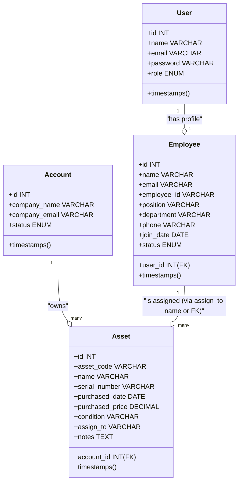

# System Architecture & Design

This document details the system design, user roles, security middleware, multi-tenancy implementation, and conceptual data diagrams of the Asset Management application.

---

## 1. Role-Based Access Control (RBAC)

The application utilizes a custom role-based authorization system mapped to three distinct user tiers, stored in the `users` table via the `role` enum column:

| Role | Database Code | Scope of Access | Middleware Gate |
| :--- | :--- | :--- | :--- |
| **Super Admin** | `super_admin` | Global scope (entire system, all tenants/organizations) | `role:super_admin` |
| **Admin** | `admin` | Organization scope (only within their assigned `account_id`) | `role:admin` |
| **Employee** | `employee` | Personal scope (only their profile and assigned assets) | `role:employee` |

### Security Middleware & Route Protection
Access control is enforced at the routing level in [routes/web.php](file:///c:/laragon/www/asset-managment/routes/web.php). The routes are partitioned into middleware groups:

1. **Super Admin Routes**: protected by `auth` and `role:super_admin` middleware.
2. **Admin Routes**: protected by `auth` and `role:admin` middleware.
3. **Combined Admin / Employee Routes**: protected by `auth` and `role:admin, employee ` middleware.

> [!WARNING]
> **Trailing Space Anomaly in Routing:**
> In [routes/web.php:L40](file:///c:/laragon/www/asset-managment/routes/web.php#L40), the role middleware group is declared as:
> `Route::middleware(['auth', 'role:admin, employee '])->group(...)`
> The trailing space in `'role:admin, employee '` can cause parameter parsing issues in route-role middleware checks depending on how the string is parsed or split by the application's underlying authorization handler.

---

## 2. Multi-Tenancy Architecture

The application is structured to support multi-tenant isolation, utilizing the `accounts` table as the representation of individual **Tenant Organizations (companies)**.

### Current Implementation State
* **Accounts Table**: Exists with columns for `company_name`, `company_email`, `subscription_plan`, and `status`.
* **Tenant Scoping Fields**:
  * The `assets` table has an `account_id` foreign key referencing the `accounts` table.
  * The `employee` table does not currently contain a direct `account_id` column. It connects to the tenant organization solely through its `user_id` -> `users.account_id` relationship (implied).
  * The `users` table does not currently contain an `account_id` column in the migration [0001_01_01_000000_create_users_table.php](file:///c:/laragon/www/asset-managment/database/migrations/0001_01_01_000000_create_users_table.php) or its role modification migrations.

### Data Scope Isolation Gap
Currently, controllers such as `AssetController` and `EmployeeController` query all records globally without filtering by the authenticated user's organization account. 
To fully implement the multi-tenancy model described in the blueprint:
1. `account_id` needs to be migrated onto the `users` and `employees` tables.
2. Controllers must apply global query scopes (e.g., `TenantScope`) or manual constraints:
   ```php
   // Expected tenant scoping pattern
   $assets = Asset::where('account_id', auth()->user()->account_id)->get();
   ```

---

## 3. Entity Relationships

The entity structure connects users, employees, accounts, and assets. Below is the conceptual entity-relationship diagram:


